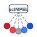
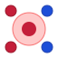

Based on the scIMPEL schematic: central box, radiating dashed lines, circular nodes with red→grey→blue gradient.

## Custom SVGs (schematic-inspired)

```{r echo=FALSE, fig.width=3, fig.height=1, out.width="150px"}
knitr::include_graphics("icons/option_custom_gradient_circles.svg")
```
**Gradient circles** — 7 cells in arc with red→grey→blue spectrum

```{r echo=FALSE, fig.width=3, fig.height=1, out.width="150px"}

```
**Radiating** — Central scIMPEL box with dashed lines to gradient nodes

```{r echo=FALSE, fig.width=3, fig.height=1, out.width="150px"}

```
**Cells only** — Concentric cells (cell + nucleus) with gradient accents

## Icons from [icons package](https://pkg.mitchelloharawild.com/icons/)

```{r setup, include=FALSE}
knitr::opts_chunk$set(echo = TRUE, fig.width = 2, fig.height = 2)
# Install: remotes::install_github("mitchelloharawild/icons")
# Then: icons::download_fontawesome(), icons::download_feather_icons()
```

```{r icon-options, fig.show='hold', out.width='80px'}
library(icons)
blue <- "#2563eb"

# Feather icons (run icons::download_feather_icons() first)
if (icon_installed("feather_icons")) {
  icon_style(feather_icons("activity"), scale = 2, fill = blue)
  icon_style(feather_icons("circle"), scale = 2, fill = blue)
  icon_style(feather_icons("grid"), scale = 2, fill = blue)
  icon_style(feather_icons("layers"), scale = 2, fill = blue)
}
```

```{r icon-options-fa, fig.show='hold', out.width='80px'}
# Font Awesome (run icons::download_fontawesome() first)
if (icon_installed("fontawesome")) {
  icon_style(fontawesome("circle", style = "solid"), scale = 2, fill = blue)
}
```

## Suggested icon names to try

| Library | Icon | Schematic match |
|---------|------|-----------------|
| Feather | `activity` | Flow/spectrum lines |
| Feather | `circle` | Single cell |
| Feather | `grid` | Cell matrix |
| Feather | `layers` | States/spectrum |
| Font Awesome | `circle-dot` | Cell + nucleus (concentric) |
| Font Awesome | `share-nodes` | Radiating connections |
| Font Awesome | `circle` | Base cell shape |
| Bioicons | `cell` (if installed) | Biology theme |

## Color palette (from schematic)

- Red: `#c41e3a`
- Grey: `#6b7280`
- Blue: `#2563eb`

Use with `icon_style(icon, fill = "#2563eb")` for single-color hex stickers.
